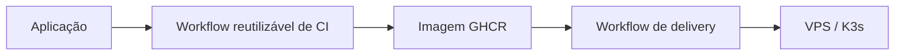

# fcs-pipelines

Repositório de **Pipelines Reutilizáveis** da plataforma **Conexão Solidária**. Centraliza workflows do GitHub Actions para CI, validações de segurança, build de imagens, delivery no K3s e automação de infraestrutura.

> Repositório de apoio que compõe a arquitetura da Conexão Solidária junto a `fcs-identity`, `fcs-campaign`, `fcs-donations`, `fcs-donation-worker`, `fcs-notifications`, `fcs-audit-logs`, `fcs-bff`, `fcs-web` e `fcs-infra`.

---

## Responsabilidades

- Padronizar os gates de CI/CD entre os repositórios da plataforma.
- Expor workflows reutilizáveis via `workflow_call`.
- Validar política de nomes de branch.
- Executar secret scan com Gitleaks.
- Executar análise de vulnerabilidades em dependências.
- Executar build, testes, cobertura e SonarCloud para serviços .NET.
- Executar formatação, lint, testes, cobertura e build para aplicações Angular.
- Validar build de imagens Docker.
- Publicar imagens no GHCR e executar deploy no K3s.
- Executar workflows de Terraform para a infraestrutura da VPS.

Este repositório **não** contém código de aplicação. Cada aplicação mantém apenas wrappers pequenos em `.github/workflows` apontando para os workflows reutilizáveis daqui.

## Compatibilidade dos runners

Os workflows usam actions executadas em Node.js 24. GitHub-hosted runners já atendem esse requisito. O runner self-hosted `fcs-vps`, usado pelo workflow de delivery K3s, deve permanecer na versão `2.327.1` ou superior.

Documentação completa da arquitetura: [group10-tc-01/fcs-fase05-docs](https://github.com/group10-tc-01/fcs-fase05-docs).

Referências diretas:

- [Visão geral da arquitetura](https://github.com/group10-tc-01/fcs-fase05-docs/blob/main/architecture/overview.md)
- [Repositórios e infraestrutura](https://github.com/group10-tc-01/fcs-fase05-docs/blob/main/architecture/repositories-and-infra.md)
- [ADR 0018 - Reutilizar fcs-pipelines para CI/CD](https://github.com/group10-tc-01/fcs-fase05-docs/blob/main/adr/0018-reuse-fcs-pipelines-for-ci-cd.md)

---

## Workflows reutilizáveis



| Workflow                                        | Finalidade                                                                                                                 |
| ----------------------------------------------- | -------------------------------------------------------------------------------------------------------------------------- |
| `.github/workflows/branch-name-check.yml`       | Política reutilizável para validação do nome das branches.                                                                 |
| `.github/workflows/dotnet-service-ci.yml`       | Build, testes, cobertura, análise de dependências, secret scan, SonarCloud e validação de build Docker para serviços .NET. |
| `.github/workflows/dotnet-service-delivery.yml` | Build, scan, push da imagem Docker para o GHCR e deploy no K3s com rolling update.                                         |
| `.github/workflows/angular-web-ci.yml`          | CI para aplicações Angular com npm audit, formatação, lint, testes, cobertura, build e validação de build Docker.          |
| `.github/workflows/gitops-image-update.yml`     | Atualização de tags de imagem em um repositório GitOps para que Argo CD ou Flux faça a reconciliação do cluster.           |
| `.github/workflows/terraform-azure.yml`         | Execução de plan e, opcionalmente, apply da infraestrutura VPS com Terraform.                                               |

---

## Estrutura do repositório

```text
.github/
  workflows/
    angular-web-ci.yml
    branch-name-check.yml
    dotnet-service-ci.yml
    dotnet-service-delivery.yml
    gitops-image-update.yml
    terraform-azure.yml
docs/
  adoption-guide.md
  required-secrets-and-vars.md
examples/
  catalog/
  catalog-ci.yml
  catalog-delivery.yml
  orchestration-terraform.yml
  solidarity-web-ci.yml
```

---

## Adoção em aplicações

Cada repositório de aplicação deve manter wrappers pequenos em `.github/workflows`.

### Serviço .NET

```yaml
name: Identity CI

on:
  pull_request:
    branches: [main]
  push:
    branches: [main]

jobs:
  ci:
    uses: group10-tc-01/fcs-pipelines/.github/workflows/dotnet-service-ci.yml@main
    with:
      service_name: identity
      dotnet_version: 8.0.x
      solution_path: fcs.Identity.slnx
      unit_tests_path: tests/fcs.Identity.UnitTests/fcs.Identity.UnitTests.csproj
      coverage_threshold: 80
      run_sonar: true
      sonar_project_key: group10-tc-01_fcs-identity
      sonar_organization: group10-tc-01
      dockerfile_path: src/fcs.Identity.WebApi/Dockerfile
      docker_context: .
    secrets: inherit
```

### Aplicação Angular

```yaml
name: Solidarity Web Branch Policy

on:
  pull_request:
    branches: [main]
    types: [opened, synchronize, reopened, edited]

jobs:
  branch-name:
    uses: group10-tc-01/fcs-pipelines/.github/workflows/branch-name-check.yml@main
    with:
      allowed_pattern: ^(feature|fix|bugfix|hotfix|release|chore|docs|refactor|test)\/[a-z0-9._-]+$
      allow_main: false
```

```yaml
name: Solidarity Web CI

on:
  pull_request:
    branches: [main]
  push:
    branches: [main]

jobs:
  ci:
    uses: group10-tc-01/fcs-pipelines/.github/workflows/angular-web-ci.yml@main
    with:
      app_name: fcs-web
      node_version: "24"
      working_directory: .
      coverage_threshold: 80
      run_coverage: true
      dockerfile_path: Dockerfile
      docker_context: .
```
